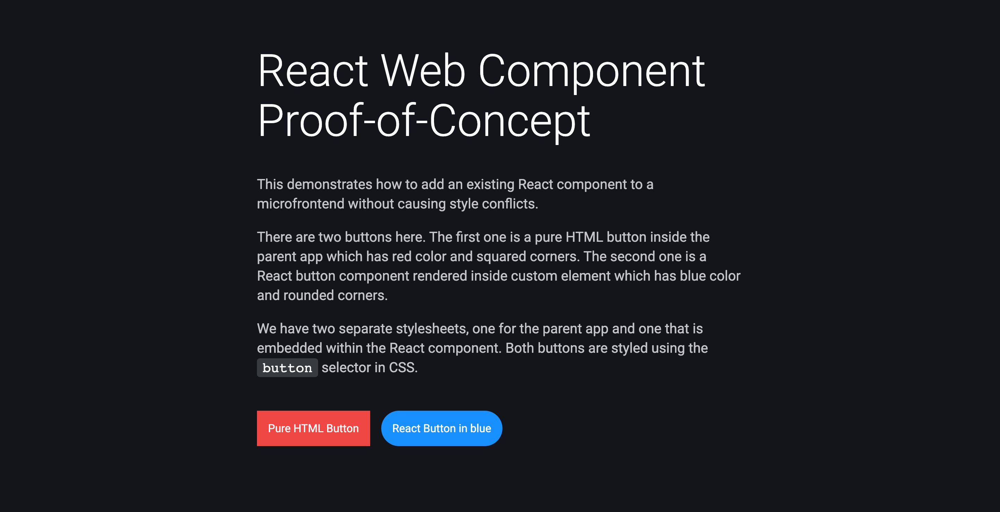

# React Web Component Proof-of-Concept

Demonstrates how to add an existing React component to a microfrontend without causing style conflicts.

[Live demo](https://icelam.github.io/just-for-fun/react-web-component-poc/)



## Tech Stack

- Web Component
- React

## How to start

### Prerequisites

- Node 16 above or nvm installed
- Yarn or NPM installed

### 1. Install dependencies

To install dependencies:

```bash
cd ./parent-app
yarn install

cd ./react-app
yarn install
```

### 2. Start development server for React app

To start the development server:

```bash
cd ./react-app
yarn start
```

### 2. Start development server for parent app

To start the development server:

```bash
cd ./react-app
yarn build

cd ../parent-app
yarn start
```

### 3. Build production

To build the project for production:

```bash
cd ./parent-app
yarn build

cd ../react-app
yarn build
```

All the build files can be found in `dist` folder.
