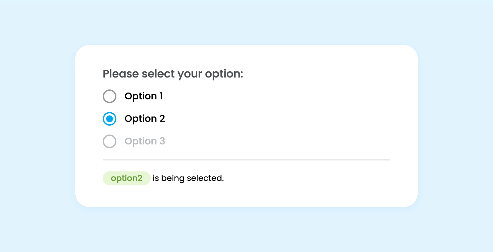

# React Radio Group

React radio group component with animation and keyboard support.

The component have hover and focus effect adjusted based on the following rules:

1. Hover effects are removed from touch devices as they usually treats click event as hover, and keep showing hover effect until user taps on other elements of a page.
2. Gray border is added to a label which is focused via <kbd>Tab</kbd> for accessibility.

[Live demo](https://icelam.github.io/just-for-fun/react-radio-group/)



## Tech Stack

- React
- CSS

## How to start

### Prerequisites

- Node 16 above or nvm installed
- Yarn or NPM installed

### 1. Install dependencies

To install dependencies:

```bash
yarn install
```

### 2. Start development server

To start the development server:

```bash
yarn start
```

### 3. Build production

To build the project for production:

```bash
yarn build
```

All the build files can be found in `build` folder.
