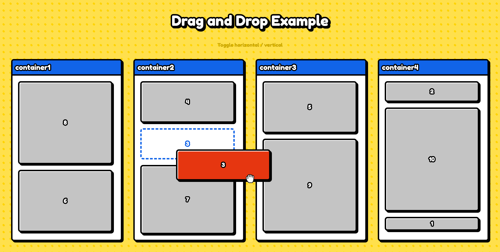

# React Multiple Container Drag and Drop

Drag and drop blocks between different containers using [dnd kit](https://dndkit.com/).

[Live demo](https://icelam.github.io/just-for-fun/react-drag-and-drop/)



## Tech Stack

- React
- [dnd kit](https://dndkit.com/)

## How to start

### Prerequisites

- Node 16 above or nvm installed
- Yarn or NPM installed

### 1. Install dependencies

To install dependencies:

```bash
yarn install
```

### 2. Start development server

To start the development server:

```bash
yarn start
```

### 3. Build production

To build the project for production:

```bash
yarn build
```

All the build files can be found in `build` folder.
