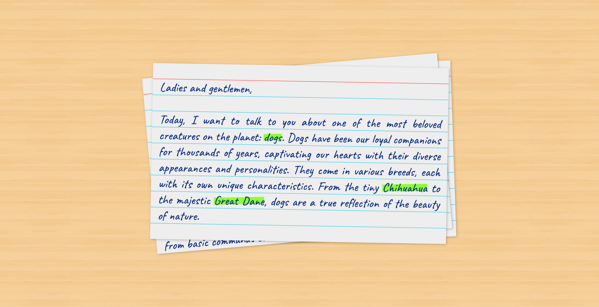

# Card Stack Animation

An animated stack of ruled index cards created using CSS3 animations. The ruled index cards make use of the `linear-gradient` to create line patterns and highlight pen effects.

[Live demo](https://icelam.github.io/just-for-fun/card-stack-animation/)



## Tech Stack

- CSS

## How to start

### Prerequisites

- Node 16 above or nvm installed
- Yarn or NPM installed

### 1. Install dependencies

To install dependencies:

```bash
yarn install
```

### 2. Start development server

To start the development server:

```bash
yarn start
```

### 3. Build production

To build the project for production:

```bash
yarn build
```

All the build files can be found in `dist` folder.
